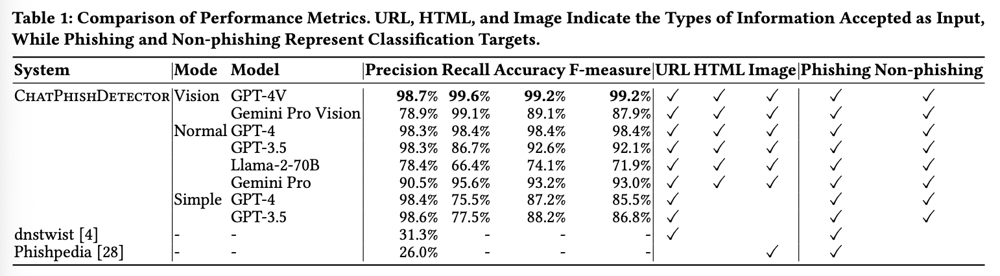

# Detecting Phishing Sites Using ChatGPT: A Paper Review
The methods for detecting phishing sites have evolved with the success of machine learning.  
This post reviews a research paper titled "Detecting Phishing Sites Using ChatGPT," which leverages large language models (LLMs) to identify phishing sites.  
The main idea is simple, yet highly effective based on my experience with this method.

You can read this paper here: https://arxiv.org/pdf/2306.05816

## Overview  
This paper proposes an LLM-based method called ChatPhishDetector to detect phishing sites.  
The key components of ChatPhishDetector are as follows:  
- Prompt Engineering  
- Screenshot & OCR (choose one option)  

  
The figure above shows the architecture of ChatPhishDetector. It consists of two modes: normal mode and vision mode.

In normal mode, OCR extracts text from screenshots of phishing sites and uses this text as part of the prompt.  
In vision mode, the screenshot is provided as input to a multi-modal inference service.

### Prompt Engineering
This paper designs the prompt based on Chain-of-Thought (CoT), which encourages LLMs to explain their reasoning step by step.

The proposed prompt for normal mode is shown below:
```
You are a web programmer and security expert tasked with examining a web page to determine if it is a phishing site or a legitimate site. To complete this task, follow these sub-tasks:

1. Analyze the HTML, URL, and OCR-extracted text screenshot image for any SE techniques often used in phishing attacks. Point out any suspicious elements found in the HTML, URL, or text.

2. Identify the brand name. If the HTML appears to resemble a legitimate web page, verify if the URL matches the legitimate domain name associated with the brand, if known.

3. State your conclusion on whether the site is a phishing site or a legitimate one, and explain your reasoning. If there is insufficient evidence to make a determination, answer "unknown".

4. Submit your findings as JSON-formatted output with
the following keys:
- phishing_score: int (indicates phishing risk on a
scale of 0 to 10)
- brands: str (identified brand name or None if not
applicable)
- phishing: boolean (whether the site is a phishing
site or a legitimate site)
- suspicious_domain: boolean (whether the domain name
is suspected to be not legitimate)

Limitations:
- The HTML may be shortened and simplified.
- The OCR-extracted text may not always be accurate.
Examples of social engineering techniques:
- Alerting the user to a problem with their account
- Offering unexpected rewards
- Informing the user of a missing package or additional payment required
- Displaying fake security warnings

URL:
{URL}

HTML:
``` {Browser-rendered HTML} ```

Text extracted using OCR:
``` {OCR-extracted text} ```
```
This 4-step Chain-of-Thought (CoT) method demonstrates its effectiveness in detecting phishing sites.

### Simplify HTML
Since the full HTML of a website is too lengthy to be processed by LLMs, the authors simplify the HTML to reduce the token length for better performance.

The procedure for simplifying HTML is as follows:  
- Remove and unwrap unnecessary HTML elements, such as `style`, `script`, and `comment` tags.  
- Shorten `href` and `src` attributes.  
- Repeat this process until the token length is reduced to below 3000.

### Evaluation  
To evaluate ChatPhishDetector, the paper used three phishing site datasets (OpenPhish, PhishTank, and CrowdCanary) and one non-phishing dataset, the Tranco list.

  
From the figure above, we can observe some interesting results.

#### Vision Mode vs. Normal Mode  
The main difference between the two modes is whether OCR is applied to the screenshot of the webpage. In vision mode, the raw screenshot is used as input for GPT, whereas in normal mode, OCR-extracted text is used as input. When comparing the two modes, vision mode achieved higher performance, suggesting that it is a better choice for most users, as it avoids the complexity of extracting text with OCR.

#### Model Choice  
When compared with various models (GPT, Llama, Gemini), GPT-4 achieved the highest performance. The other models recorded lower recall. Considering their service costs, using cheaper services such as GPT-3.5 ($0.008 per sample) is much more cost-effective compared to using the more expensive models (e.g., $0.179 per sample).

### My Thoughts
The proposed method mainly focuses on prompt engineering for detecting phishing sites.  
I believe the main advantage is that readers can easily adapt this method using LLM services like ChatGPT.  
This method can also be easily extended to detect other types of malicious sites, such as gambling and adult sites.  
When I made adjustments to certain parts of the prompt, the detection worked effectively.
