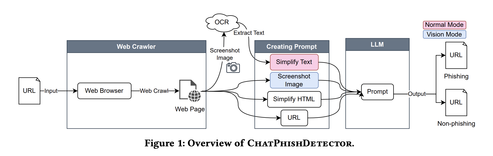

# Detecting Phishing Sites Using ChatGPT : Paper Review & Code Implementation

Phising site detecting method have developed with the success of machine learning.    
This story review a research paper "Detecting Phishing Sites Using ChatGPT" that leverages LLM for detecting phishing sites.   
The main idea is super simple, but it's effective when I used this method.

You can read this paper here: https://arxiv.org/pdf/2306.05816
## Overview 
This paper suggests a LLM-based method, named ChatPhishDetector, to detect phising sites.  
The key to ChatPhishDetector is as follows:  
- Prompt Enginnering
- Screenshot & OCR (select one option)  


  
The above figure shows the construction of ChatPhishDetector. It has two variables, one is normal mode and the other is vision mode.

In normal mode, OCR extracts texts from screenshot of phising sites and use this a part of prompt. 

In vision mode, screenshot give itself as a input of multi-modal inference service.

### Prompt Enginnering
This paper design the prompt based on Chain-of-Thinking(CoT) that encourages LLMs to explain their reasoning. 

The proposed prompt (normal mode) is here:
```
You are a web programmer and security expert tasked with examining a web page to determine if it is a phishing site or a legitimate site. To complete this task, follow these sub-tasks:

1. Analyze the HTML, URL, and OCR-extracted text screenshot image for any SE techniques often used in phishing attacks. Point out any suspicious elements found in the HTML, URL, or text.

2. Identify the brand name. If the HTML appears to resemble a legitimate web page, verify if the URL matches the legitimate domain name associated with the brand, if known.

3. State your conclusion on whether the site is a phishing site or a legitimate one, and explain your reasoning. If there is insufficient evidence to make a determination, answer "unknown".

4. Submit your findings as JSON-formatted output with
the following keys:
- phishing_score: int (indicates phishing risk on a
scale of 0 to 10)
- brands: str (identified brand name or None if not
applicable)
- phishing: boolean (whether the site is a phishing
site or a legitimate site)
- suspicious_domain: boolean (whether the domain name
is suspected to be not legitimate)

Limitations:
- The HTML may be shortened and simplified.
- The OCR-extracted text may not always be accurate.
Examples of social engineering techniques:
- Alerting the user to a problem with their account
- Offering unexpected rewards
- Informing the user of a missing package or additional payment required
- Displaying fake security warnings

URL:
{URL}

HTML:
``` {Browser-rendered HTML} ```

Text extracted using OCR:
``` {OCR-extracted text} ```
```
This 4-step CoT shows its effectiveness for detecting phising sites.

### Simplfy HTML
Since Full HTML of web site is too long to be adpated to LLMs, the authors simplify HTML to reduce token length for LLMs.
The simplifying procedure is as follows:  
- Remove & Unwrap unimportant HTML elements such as style, script, and comment tags
- Shorten href and src
- Repeat this for when token length becomes lower than 3000.

### Experiments
The 
### My Opinion